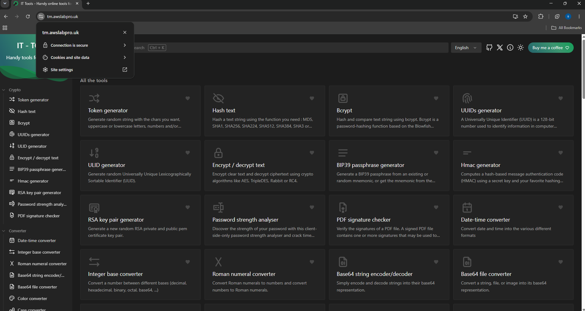
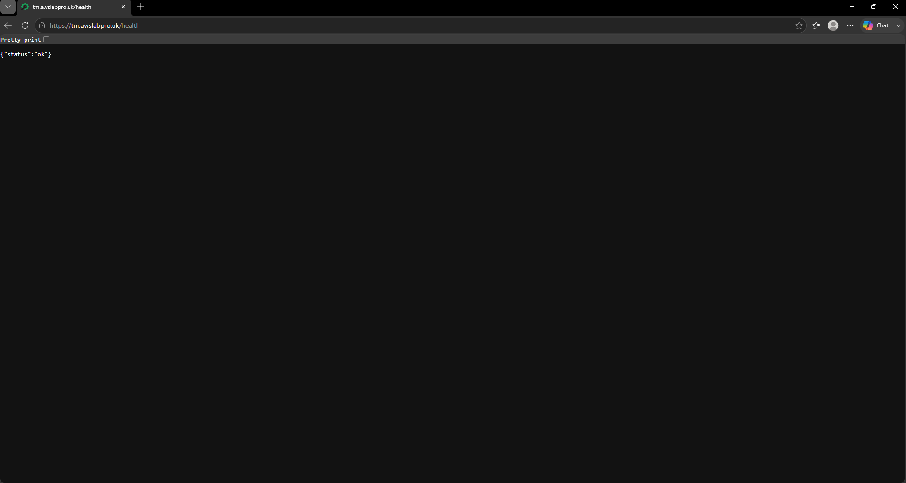
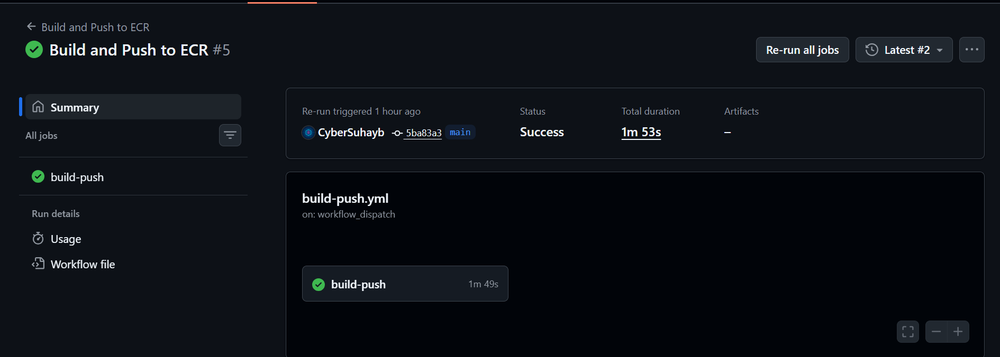
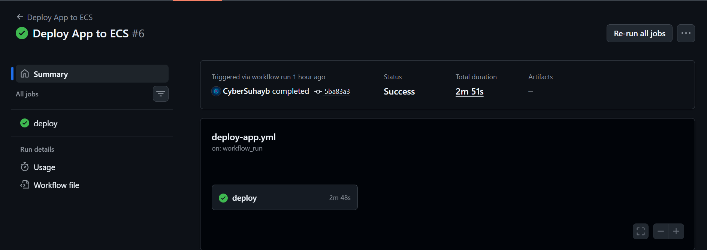
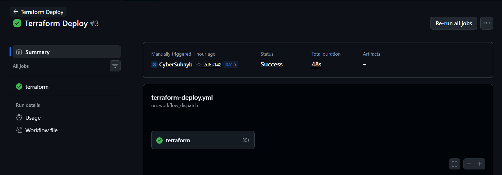

# IT Tools ECS Deployment

A production-style container deployment on AWS ECS Fargate, running [IT Tools](https://github.com/CorentinTh/it-tools) behind an Application Load Balancer in a secure Multi-AZ VPC with public and private subnets. Infrastructure is provisioned through modular Terraform with remote state and locking in Amazon S3, and GitHub Actions automates container builds and infrastructure deployment using OIDC — no long-lived AWS credentials stored anywhere.

The application runs as an ECS Fargate task inside private subnets with no public IP, reachable only through the ALB. Docker images are stored in Amazon ECR and versioned by commit SHA. HTTPS is provided through AWS Certificate Manager, with Route 53 handling DNS. Amazon CloudWatch collects application logs from the running ECS task.

The infrastructure was first built manually through the AWS Console (ClickOps) to understand how ECS, the ALB, and the surrounding networking actually fit together, then torn down and rebuilt entirely as Terraform, split across five reusable modules. Three separated GitHub Actions pipelines handle building and pushing the image, deploying it to ECS, and applying infrastructure changes — each independently triggerable, so a routine app deploy never risks touching the VPC or ALB.

Live at: https://tm.awslabpro.uk

## Table of Contents
- Architecture
- What is this application?
- HTTPS
- Health Check
- CI/CD Pipelines
- Key Decisions
- Local Setup
- Project Structure
- Lessons Learned
- Future Improvements

## Architecture


The VPC spans two Availability Zones, eu-west-2a and eu-west-2c. The ALB and NAT Gateway sit in public subnets; the ECS task runs in a private subnet with no public IP — it has no direct route to or from the internet. Outbound traffic (pulling from ECR, sending logs to CloudWatch) goes through the NAT Gateway. The ALB is the only internet-facing component in the whole stack.

This goes beyond the project brief's minimum requirement of a VPC with public subnets — a service running with a public IP is a real exposure risk in production, so the private-subnet split was worth the extra NAT Gateway module.

## What is this application?

IT Tools is a free, open-source collection of everyday developer utilities (UUID generators, JSON formatters, encoders, hash generators, and more) served as a single static frontend. I picked it because it's lightweight, has no backend or database dependency, and let me focus entirely on the deployment and infrastructure side rather than debugging application code — the whole point of this project was learning ECS, Terraform, and CI/CD, not building an app.

## HTTPS

- Certificate issued and DNS-validated via AWS Certificate Manager, against a Route53 hosted zone for awslabpro.uk
- Since the domain was registered through Cloudflare rather than Route53, I delegated just the tm subdomain to Route53 using NS records, rather than migrating the whole domain — Route53 only needed to own DNS validation and routing for this one subdomain
- ALB listener on 443 forwards to the ECS target group
- ALB listener on 80 issues a permanent redirect to 443



## Health Check

nginx serves a dedicated /health location returning a status of ok, independent of the app's static files. This is used by:
- The ALB target group's health check, which expects HTTP 200
- The CI/CD deploy pipeline's post-deploy verification step, which fails the pipeline if the app doesn't respond healthy after a deployment



## CI/CD Pipelines

Three separated GitHub Actions workflows, each usable manually via workflow dispatch, all authenticating to AWS through OIDC — GitHub issues a short-lived identity token per run, which AWS exchanges for temporary credentials scoped to a single IAM role trusted only by this specific repository. No AWS access keys exist in GitHub at all.

**1. Build and Push to ECR** — triggers on push to the app source, Dockerfile, or nginx config. Builds the Docker image, tags it with the commit SHA, pushes to ECR.



**2. Deploy App to ECS** — chained to run automatically after Build and Push succeeds. Fetches the current task definition, swaps in the new image tag, registers it as a new revision, updates the ECS service, waits for the service to stabilize, then verifies the health endpoint.



**3. Terraform Deploy** — triggers only on changes inside the infra folder, kept deliberately separate from app deploys so a code change never risks touching live infrastructure. Runs a formatting check, validation, plan saved to a file, then apply on that exact saved plan.



**4. Terraform Destroy** — manual-only, gated behind typing "destroy" as an explicit workflow input. Never runs automatically.

## Key Decisions

- Private subnets over the brief's minimum requirement — see Architecture above.
- Separate app-deploy and infra-deploy pipelines — real teams don't run a full Terraform apply on every app code change; infra changes are rarer and reviewed separately from routine app deploys. Coupling them risks an app change accidentally touching the VPC, ALB, or security groups.
- Remote Terraform state in S3 — not required by the brief, but state stored only on a local machine has no recovery path if that machine is lost, and risks accidental commits of sensitive state data. Set up with versioning and public access blocked.
- Immutable ECR tags plus a lifecycle policy — every push gets a unique, permanent tag matching the commit SHA; an expiry policy cleans up untagged or orphaned images automatically.
- pnpm over npm — the app's lockfile is pnpm-specific; installing with plain npm silently resolved an incompatible dependency version and broke the build in a way that wasn't obvious until deep in the stack trace.

## Local Setup

### Prerequisites
- Docker Desktop
- Terraform 1.5 or newer
- AWS CLI v2, authenticated with permissions to create the resources this project provisions
- An existing Route53 hosted zone or delegated subdomain for your domain

### Steps

1. Clone the repository and enter it.
2. Build and test the container locally — build the image, run it mapping port 80 to the container's 8080, then check that the health endpoint on localhost returns a status of ok.
3. Push the image to ECR once, before Terraform's ECS service can pull it — authenticate Docker to ECR, tag the local image, and push it.
4. From the infra folder, run terraform init, then plan and apply, supplying your Route53 zone ID and an image tag as variables.
5. Verify the live app by checking your domain's health endpoint over HTTPS.

For CI/CD, set two GitHub repository secrets: one holding the IAM role ARN, and one holding the Route53 zone ID.

## Project Structure

```
├── app/                     IT Tools application source
├── infra/                   Terraform
│   ├── main.tf                Root module, wires all modules together
│   ├── variables.tf
│   ├── output.tf
│   ├── provider.tf
│   ├── backend.tf             S3 remote state and locking
│   └── modules/
│       ├── vpc/                 VPC, public and private subnets, IGW, NAT
│       ├── ecr/                  Container registry, lifecycle policy
│       ├── acm/                   Certificate and DNS validation
│       ├── alb/                    Load balancer, listeners, target group
│       └── ecs/                     Cluster, task definition, service, IAM
├── .github/workflows/       CI/CD pipelines
├── docs/                    Screenshots and diagrams
├── Dockerfile                Multi-stage build, non-root nginx runtime
├── nginx.conf
└── README.md
```

## Lessons Learned

- GitHub's OIDC subject claim format isn't what most existing docs and tutorials show. It now includes numeric owner and repo IDs, not just names as the classic examples suggest. A trust policy written against the older wildcard pattern fails with a generic "not authorized" error that gives zero indication the claim format is the actual problem — fixed it by adding a debug step that pulled and printed the raw token claims directly, rather than guessing at the trust policy repeatedly.
- The session-tagging permission is separate and easy to miss. The AWS credentials action tags the assumed role session by default; without explicitly trusting that permission alongside the main assume-role action, the entire call fails, and the error message doesn't distinguish this from a broken trust policy.
- Package manager mismatches fail in confusing, downstream ways. The app's lockfile was generated with pnpm; installing with plain npm resolved a different, incompatible version of a transitive dependency, producing a build error deep in an unrelated file rather than a clear "wrong package manager" message.
- A formatting check will fail CI on cosmetic issues alone, even when the code is functionally correct — worth running a recursive format pass locally before every push touching the infrastructure folder.
- Changing an Availability Zone on an existing subnet forces Terraform to destroy and recreate it, and an Application Load Balancer can take many minutes to release its network interface from the old subnet before that deletion can complete — not a hang, just a slow, well-documented AWS behaviour.

## Future Improvements

- Scope the CI/CD IAM role's permissions to exact resource ARNs and actions rather than several broad AWS-managed policies — the current IAM access policy in particular is far wider than this pipeline strictly needs
- Add a linting step and a Slack or job-summary notification to the CI/CD pipeline
- Move account-specific values into AWS Systems Manager Parameter Store instead of passing them as plain Terraform variables
- Add a second NAT Gateway, one per Availability Zone, for resilience — the current single NAT Gateway is a cost trade-off that introduces an AZ dependency
- Add ECS auto-scaling based on CPU and memory utilization
