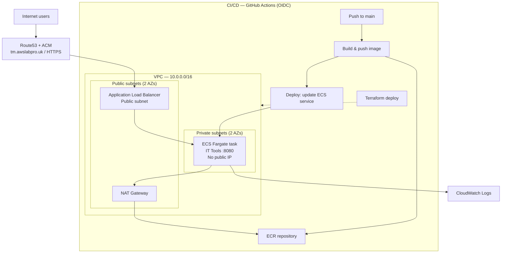

# IT Tools ECS Deployment

Self-hosted IT Tools (https://github.com/CorentinTh/it-tools), containerised and deployed on AWS ECS Fargate with HTTPS and a custom domain.

## Architecture Diagram 
## Architecture

## HTTPS
TODO

## Health Check
See /docs

## CI/CD Pipelines

## Local Setup
#Prerequisites

## Project Structure

## Lessons Learned

## Future Improvements
