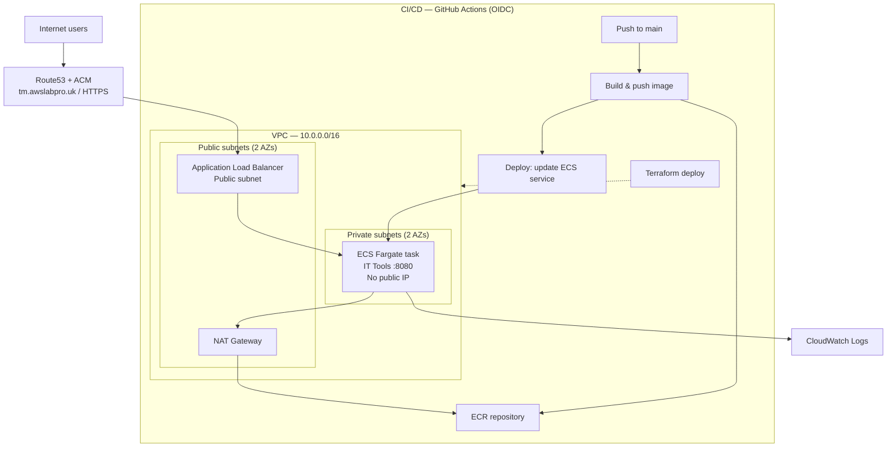

# IT Tools ECS Deployment

Self-hosted [IT Tools](https://github.com/CorentinTh/it-tools), containerised and deployed on AWS ECS Fargate behind an Application Load Balancer, secured with HTTPS on a custom domain. Built manually via ClickOps first to understand the underlying AWS services, then torn down and rebuilt entirely as modular Terraform, with three separated GitHub Actions pipelines automating the build, deploy, and infrastructure lifecycle using OIDC — no long-lived AWS credentials stored anywhere.

**Live at:** [https://tm.awslabpro.uk](https://tm.awslabpro.uk)

## Table of Contents
- [Architecture](#architecture)
- [What is this application?](#what-is-this-application)
- [HTTPS](#https)
- [Health Check](#health-check)
- [CI/CD Pipelines](#cicd-pipelines)
- [Key Decisions](#key-decisions)
- [Local Setup](#local-setup)
- [Project Structure](#project-structure)
- [Lessons Learned](#lessons-learned)
- [Future Improvements](#future-improvements)

## Architecture



The VPC spans two Availability Zones (`eu-west-2a`/`eu-west-2b`). The ALB and NAT Gateway sit in public subnets; the ECS task runs in a private subnet with `assign_public_ip = false` — it has no direct route to or from the internet. Outbound traffic (pulling from ECR, sending logs to CloudWatch) goes through the NAT Gateway. The ALB is the only internet-facing component in the whole stack.

This goes beyond the project brief's minimum ("VPC with public subnets") deliberately — a service running with a public IP is a real exposure risk in production, so the private-subnet split was worth the extra NAT Gateway module.

## What is this application?

[IT Tools](https://github.com/CorentinTh/it-tools) is a free, open-source collection of everyday developer utilities (UUID generators, JSON formatters, encoders, hash generators, and more) served as a single static frontend. I picked it because it's lightweight, has no backend/database dependency, and let me focus entirely on the deployment and infrastructure side rather than debugging application code — the whole point of this project was learning ECS, Terraform, and CI/CD, not building an app.

## HTTPS

- Certificate issued and DNS-validated via **AWS Certificate Manager**, against a Route53 hosted zone for `awslabpro.uk`
- Since the domain was registered through Cloudflare (not Route53), I delegated just the `tm` subdomain to Route53 using NS records, rather than migrating the whole domain — Route53 only needed to own DNS validation and routing for this one subdomain
- ALB listener on **443** forwards to the ECS target group
- ALB listener on **80** issues a permanent redirect to **443**


## Health Check

nginx serves a dedicated `/health` location returning `{"status":"ok"}`, independent of the app's static files. This is used by:
- The ALB target group's health check (`/health`, expects HTTP 200)
- The CI/CD deploy pipeline's post-deploy verification step, which fails the pipeline if the app doesn't respond healthy after a deployment

## CI/CD Pipelines

Three separated GitHub Actions workflows, each usable via `workflow_dispatch`, all authenticating to AWS through **OIDC** — GitHub issues a short-lived identity token per run, which AWS exchanges for temporary credentials scoped to a single IAM role trusted only by this specific repository. No AWS access keys exist in GitHub at all.

**1. Build and Push to ECR** — triggers on push to `app/`, `Dockerfile`, or `nginx.conf`. Builds the Docker image, tags it with the commit SHA (immutable versioning, no `latest` tag drift), pushes to ECR.


**2. Deploy App to ECS** — chained to run automatically after Build and Push succeeds. Fetches the current task definition, swaps in the new image tag, registers it as a new revision, updates the ECS service to that revision, waits for the service to stabilize, then verifies `/health`.


**3. Terraform Deploy** — triggers only on push to `infra/**`, kept deliberately separate from app deploys so a code change never risks touching live infrastructure. Runs `terraform fmt -check`, `validate`, `plan` (saved to a file), then `apply` on that exact saved plan.


**4. Terraform Destroy** — manual-only, gated behind typing `destroy` as an explicit workflow input. Never runs automatically.

## Key Decisions

- **Private subnets over the brief's minimum** — see Architecture above.
- **Separate app-deploy and infra-deploy pipelines** — real teams don't run a full `terraform apply` on every app code change; infra changes are rarer and reviewed separately from routine app deploys. Coupling them risks an app change accidentally touching the VPC/ALB/security groups.
- **Remote Terraform state in S3** — not required by the brief, but state stored only on a local machine has no recovery path if that machine is lost, and risks accidental commits of sensitive state data. Set up with versioning and public access blocked.
- **Immutable ECR tags + lifecycle policy** — every push gets a unique, permanent tag (the commit SHA); an expiry policy cleans up untagged/orphaned images automatically.
- **pnpm over npm** — the app's lockfile is pnpm-specific; using plain `npm install` silently resolved an incompatible dependency version and broke the build in a way that wasn't obvious until deep in the stack trace.

## Local Setup

### Prerequisites
- Docker Desktop
- Terraform >= 1.5
- AWS CLI v2, authenticated with permissions to create the resources this project provisions
- An existing Route53 hosted zone (or delegated subdomain) for your domain

### Steps

```bash
# 1. Clone
git clone https://github.com/CyberSuhayb/it-tools-ecs-deployment.git
cd it-tools-ecs-deployment

# 2. Build and test the container locally
docker build -t it-tools .
docker run -p 80:8080 it-tools
curl http://localhost/health   # {"status":"ok"}

# 3. Push the image to ECR (needed once, before ECS can pull it)
aws ecr get-login-password --region eu-west-2 | docker login --username AWS --password-stdin <account-id>.dkr.ecr.eu-west-2.amazonaws.com
docker tag it-tools:latest <account-id>.dkr.ecr.eu-west-2.amazonaws.com/it-tools:<tag>
docker push <account-id>.dkr.ecr.eu-west-2.amazonaws.com/it-tools:<tag>

# 4. Deploy infrastructure
cd infra
terraform init
terraform plan  -var="zone_id=<your-zone-id>" -var="image_tag=<tag>"
terraform apply -var="zone_id=<your-zone-id>" -var="image_tag=<tag>"

# 5. Verify
curl https://tm.<your-domain>/health
```

For CI/CD, set these GitHub repository secrets: `AWS_ROLE_ARN`, `ROUTE53_ZONE_ID`.

## Project Structure

```
├── app/                     # IT Tools application source
├── infra/                   # Terraform
│   ├── main.tf                # Root module — wires all modules together
│   ├── variables.tf
│   ├── output.tf
│   ├── provider.tf
│   ├── backend.tf             # S3 remote state + locking
│   └── modules/
│       ├── vpc/                 # VPC, public/private subnets, IGW, NAT
│       ├── ecr/                  # Container registry, lifecycle policy
│       ├── acm/                   # Certificate + DNS validation
│       ├── alb/                    # Load balancer, listeners, target group
│       └── ecs/                     # Cluster, task definition, service, IAM
├── .github/workflows/       # CI/CD pipelines
├── docs/                    # Screenshots
├── Dockerfile                # Multi-stage build, non-root nginx runtime
├── nginx.conf
└── README.md
```

## Lessons Learned

- **GitHub's OIDC `sub` claim format isn't what most existing docs and tutorials show.** It now includes numeric owner/repo IDs (`repo:OWNER@ID/REPO@ID:ref:...`), not just names as the classic examples suggest. A trust policy written against the older wildcard pattern fails with a generic "not authorized to perform sts:AssumeRoleWithWebIdentity" error that gives zero indication the claim format itself is wrong. Fixed it by adding a debug step that pulled and printed the raw token claims directly, rather than guessing at the trust policy repeatedly.
- **`sts:TagSession` is a separate, easy-to-miss permission.** `aws-actions/configure-aws-credentials` tags the assumed role session by default; without explicitly trusting `sts:TagSession` alongside `sts:AssumeRoleWithWebIdentity`, the entire assume-role call fails — and the error message doesn't distinguish this from a broken trust policy.
- **Package manager mismatches fail in confusing, downstream ways.** The app's lockfile was generated with pnpm; installing with plain `npm install` resolved a different, incompatible version of a transitive dependency, producing a build error deep in an unrelated file rather than a clear "wrong package manager" message.
- **`terraform fmt -check` will fail CI on cosmetic issues alone**, even when the code is functionally correct — worth running `terraform fmt -recursive` locally before every push touching `infra/`.

## Future Improvements

- Scope the CI/CD IAM role's permissions to exact resource ARNs and actions rather than several broad AWS-managed policies (`IAMFullAccess` in particular is far wider than this pipeline strictly needs)
- Add `tflint` and a Slack/job-summary notification step to the CI/CD pipeline
- Move account-specific values (`zone_id`, image tags) into AWS Systems Manager Parameter Store instead of passing them as plain Terraform variables
- Add a second NAT Gateway (one per AZ) for resilience — the current single NAT Gateway is a cost trade-off that introduces an AZ dependency
- Add ECS auto-scaling based on CPU/memory utilization
